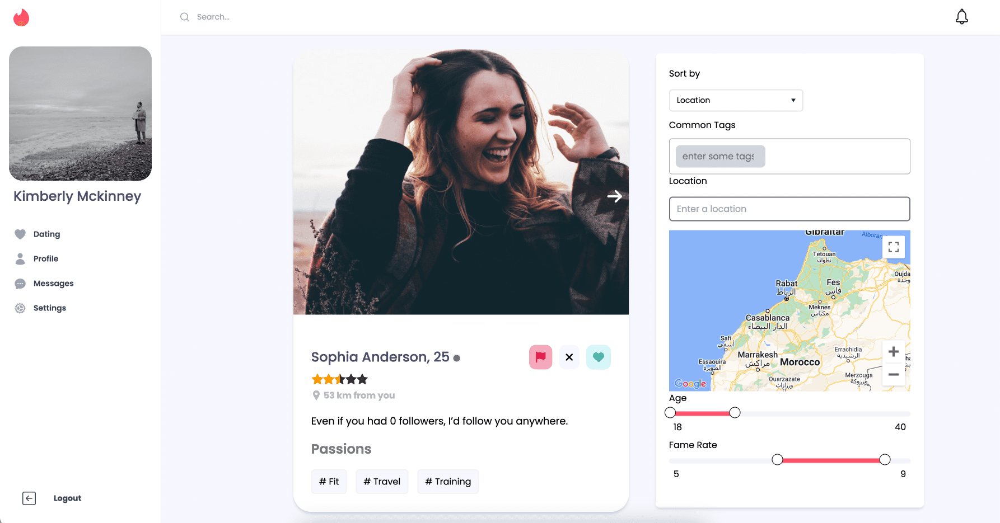

# Matcha (Tinder Clone) Project

<!--  **Demo:** Explore the live demo of this project at [matcha.hmellahi.me](https://matcha.hmellahi.me) ( still working on it) -->

## Project Overview

Matcha is a modern web application inspired by Tinder's swiping interface. It enables users to discover potential matches based on shared interests and location. If two users mutually swipe right on each other's profiles, they can connect and start chatting, potentially leading to meaningful connections.

<!-- 

  
  
<em>Screenshot of the Matcha Feed Page</em>

 -->

## Technology Stack

This project employs a range of cutting-edge technologies:

  
  <strong>Vue 3:</strong> Frontend framework for building user interfaces.

  
  <strong>Tailwind CSS:</strong> Styling library for modern and responsive user interfaces.

  
  <strong>Express JS:</strong> Backend framework for building the server-side application logic.

  
  <strong>Postgres:</strong> Database for efficient data storage with native SQL queries.

  
  <strong>WebSockets:</strong> Real-time communication for online gameplay and chat.

  
  <strong>TypeScript:</strong> Superset of JavaScript with static typing for enhanced development.

## Installation

To run the Matcha project locally, follow these steps:

1. Ensure Docker is installed on your system. Refer to the Docker documentation for installation instructions.
2. Clone the project repository to your local machine.
3. Navigate to the `database` directory within the project using the terminal.
4. Execute the `sh run.sh` command to start the necessary database services.

Once the application is built and launched, access it by visiting [http://localhost:8890](http://localhost:8890) in your web browser.

## Key Features

### Registration and Signing-in

- Users can register with their email address, username, name, and protected password. A verification link is sent via email for account confirmation.
- Secure user login and password reset functionality.
- Convenient one-click logout from any page.

### User Profile

- Users can create detailed profiles including gender, sexual preferences, biography, interests with reusable tags, and profile pictures.
- Profile information is modifiable, including personal details.
- Tracking of profile visits and "likes" received from other users.
- Public "fame rating" to add an interactive element.

### Browsing and Matching

- Users receive curated match suggestions based on geographic area, common tags, and "fame rating."
- Intelligent matching prioritizes profiles from the same region and offers sort and filter options.
- Advanced search functionality with customizable criteria, including age, "fame rating," location, and interests.

### Interaction and Communication

- Explore other users' profiles, see their information, and track visits.
- "Like" a profile picture to initiate connections for real-time chat when mutual.
- Real-time chat functionality for connected users.
- Notifications for events like receiving "likes," profile views, messages, and mutual "likes."

### Location Services

- Integration of Google Maps for changing user location and enhancing the matching experience.

## Acknowledgments

This project was created by [Hamza Mellahi](https://github.com/hmellahi) and [Houssam Moumanis](https://github.com/hmoumani).

## Contributing

Contributions and feedback are welcome! Feel free to create issues or pull requests to improve this project.

---

_Disclaimer: Matcha is a project created for educational purposes and is not affiliated with Tinder or any dating platform._
